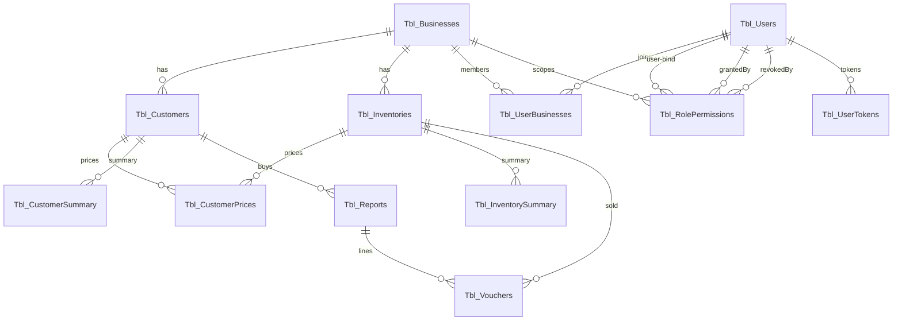
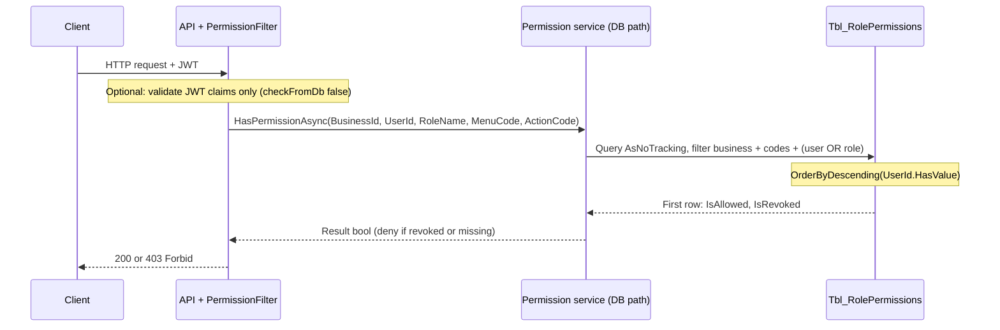

# Project Overview (Source of Truth)

This document reflects the **Unity Inventory Management System (IMS)** codebase as of the repository state under analysis: EF Core models in `Unity_Inventory.Database`, domain services in `Unity_Inventory.Domain`, REST API in `Unity_Inventory.Api`, and an ASP.NET Core MVC companion app in `Unity_Inventory.WebApp`. Where the checked-in SQL script `dbscript.sql` diverges from EF (older snapshot), **EF Core configuration and entity classes are authoritative** unless you explicitly migrate the database from that script.

---

## Project Identity & Tech Stack

### Purpose

Multi-tenant style **inventory and sales** backend for businesses: users authenticate, belong to one or more businesses (via membership), and manage **customers**, **inventory items**, **per-customer pricing**, **stock summaries**, **sales reports**, and **voucher line items**. **Role and user-scoped permissions** are stored in `Tbl_RolePermissions` and are intended to gate API access (filter + domain check) and optionally embed into JWTs when issuing tokens scoped to a business.

### Technologies

| Layer | Technology |
|--------|------------|
| Runtime | **.NET 8** (`net8.0`) |
| API | ASP.NET Core Web (`Unity_Inventory.Api`), JWT Bearer auth, Swagger / OpenAPI, **Scalar** API reference, **Serilog** |
| MVC UI | ASP.NET Core MVC (`Unity_Inventory.WebApp`), **Rotativa.AspNetCore** (PDF) |
| Data | **EF Core 8** + **SQL Server** (`Microsoft.EntityFrameworkCore.SqlServer`) |
| Auth | **BCrypt.Net-Next**, **System.IdentityModel.Tokens.Jwt** |
| Media | **CloudinaryDotNet** (image upload pipeline in domain) |
| Shared | Small **Unity_Inventory.Shared** library (`Result`, pagination types); middleware types live under `Unity_Inventory.Domain` but use namespace `Unity_Inventory.Shared.Middlewares` |

**Not present in packages:** Redis, distributed cache, Hangfire, SignalR, etc.

---

## Database Architecture (Critical)

**Schema:** `dbo` (SQL Server). **Database name (dev):** `IMS_NEW` (see `IMSDbContext` `#warning` connection string and `dbscript.sql`; production should use `appsettings` / `DefaultConnection` from `FeaturesManager`).

### Table reference (EF entities → physical tables)

Types below follow **C# / EF** (`?` = nullable reference/value type). SQL nullability aligns with EF required vs optional configuration.

#### `Tbl_Businesses` (`TblBusiness`)

| Column | CLR type | Nullable | Notes |
|--------|----------|----------|--------|
| BusinessId | `int` | no | PK, identity |
| BusinessName | `string` | no | `nvarchar(100)` |
| SubscriptionTier | `string?` | yes | `varchar(50)`, default `"Free"` |
| OwnerId | `int` | no | **No FK configured in EF**; used in `BusinessService` for ownership checks |

**Indexes / constraints (EF):** PK only on `BusinessId`.

#### `Tbl_Users` (`TblUser`)

| Column | CLR type | Nullable | Notes |
|--------|----------|----------|--------|
| UserId | `int` | no | PK |
| Username | `string?` | yes | `nvarchar(50)` |
| Name | `string` | no | `nvarchar(50)` |
| Email | `string` | no | `nvarchar(100)` |
| PasswordHash | `string` | no | `nvarchar(255)` |
| ImageId | `string?` | yes | `varchar(255)` |
| ImageUrl | `string?` | yes | `varchar(2048)` |
| CreatedAt | `DateTime` | no | `datetime`, default `getdate()` |
| DeleteFlag | `bool` | no | |
| UpdatedAt | `DateTime?` | yes | `datetime` |

**Indexes / constraints:** **Unique** on `Email` (`UQ__Tbl_User__A9D10534EAB8CDCF`).

#### `Tbl_UserBusinesses` (`TblUserBusiness`)

| Column | CLR type | Nullable | Notes |
|--------|----------|----------|--------|
| UserId | `int` | no | PK composite |
| BusinessId | `int` | no | PK composite |
| Role | `string?` | yes | `varchar(50)`, default `"Owner"` |

**PK:** `(UserId, BusinessId)`.

#### `Tbl_UserTokens` (`TblUserToken`)

| Column | CLR type | Nullable | Notes |
|--------|----------|----------|--------|
| TokenId | `int` | no | PK |
| UserId | `int` | no | FK → `Tbl_Users` |
| RefreshToken | `string` | no | `nvarchar(500)` |
| TokenHash | `string` | no | `nvarchar(500)` |
| IsRevoked | `bool?` | yes | default `false` |
| ExpiryDate | `DateTime` | no | `datetime` |
| CreatedAt | `DateTime?` | yes | `datetime`, default `getdate()` |

#### `Tbl_Customers` (`TblCustomer`)

| Column | CLR type | Nullable | Notes |
|--------|----------|----------|--------|
| CustomerId | `int` | no | PK |
| BusinessId | `int` | no | FK → `Tbl_Businesses` |
| CustomerName | `string` | no | `nvarchar(50)` |
| Phone | `string?` | yes | `varchar(50)` |
| Address | `string?` | yes | `nvarchar(50)` |
| TotalItems | `int?` | yes | default `0` |
| VersionStamp | `byte[]` | no | **rowversion**, concurrency token |
| ImageUrl | `string?` | yes | `varchar(2048)` |
| ImageId | `string?` | yes | `varchar(255)` |
| CreatedAt | `DateTime?` | yes | `datetime` |
| UpdatedAt | `DateTime?` | yes | `datetime` |

**Index:** `IX_Tbl_Customers_BusinessId` on `BusinessId`.

#### `Tbl_Inventories` (`TblInventory`)

| Column | CLR type | Nullable | Notes |
|--------|----------|----------|--------|
| InventoryId | `int` | no | PK |
| BusinessId | `int` | no | FK → `Tbl_Businesses` |
| InventoryName | `string` | no | `nvarchar(50)` |
| Price | `decimal` | no | `decimal(18,2)` |
| DeleteFlag | `bool?` | yes | default `false` |
| VersionStamp | `byte[]` | no | **rowversion**, concurrency token |
| ImageUrl | `string?` | yes | `varchar(2048)` |
| ImageId | `string?` | yes | `varchar(255)` |

**Index:** `IX_Tbl_Inventories_BusinessId` on `BusinessId`.

#### `Tbl_CustomerPrices` (`TblCustomerPrice`)

| Column | CLR type | Nullable | Notes |
|--------|----------|----------|--------|
| CustomerPriceId | `int` | no | PK |
| BusinessId | `int` | no | FK |
| CustomerId | `int` | no | FK |
| InventoryId | `int` | no | FK |
| SellPrice | `decimal` | no | `decimal(18,2)` |

#### `Tbl_CustomerSummary` (`TblCustomerSummary`)

| Column | CLR type | Nullable | Notes |
|--------|----------|----------|--------|
| SummaryId | `int` | no | PK |
| BusinessId | `int` | no | FK |
| CustomerId | `int` | no | FK |
| TotalPurchased | `decimal?` | yes | `decimal(18,2)`, default `0` |
| OutstandingBalance | `decimal?` | yes | `decimal(18,2)`, default `0` |
| LastTransactionDate | `DateTime?` | yes | `datetime` |

#### `Tbl_InventorySummary` (`TblInventorySummary`)

| Column | CLR type | Nullable | Notes |
|--------|----------|----------|--------|
| SummaryId | `int` | no | PK |
| BusinessId | `int` | no | FK |
| InventoryId | `int` | no | FK |
| CurrentStock | `int?` | yes | default `0` |
| LastUpdated | `DateTime?` | yes | default `getdate()` |
| VersionStamp | `byte[]` | no | **rowversion**, concurrency token |

#### `Tbl_Reports` (`TblReport`)

| Column | CLR type | Nullable | Notes |
|--------|----------|----------|--------|
| ReportId | `int` | no | PK |
| BusinessId | `int` | no | FK |
| CustomerId | `int` | no | FK |
| ReportDate | `DateTime?` | yes | default `getdate()` |
| TotalAmount | `decimal` | no | `decimal(18,2)` |
| Remarks | `string?` | yes | `nvarchar(200)` |

**Index:** `IX_Tbl_Reports_BusinessId` on `BusinessId`.

#### `Tbl_Vouchers` (`TblVoucher`)

| Column | CLR type | Nullable | Notes |
|--------|----------|----------|--------|
| VoucherId | `int` | no | PK |
| BusinessId | `int` | no | FK |
| ReportId | `int` | no | FK → `Tbl_Reports` |
| InventoryId | `int` | no | FK |
| Quantity | `int` | no | |
| SellPrice | `decimal` | no | `decimal(18,2)` |
| SubTotal | `decimal` | no | `decimal(18,2)` |

**Index:** `IX_Tbl_Vouchers_ReportId` on `ReportId`.

#### `Tbl_RolePermissions` (`TblRolePermission`)

| Column | CLR type | Nullable | Notes |
|--------|----------|----------|--------|
| Id | `long` | no | PK |
| BusinessId | `int` | no | FK → `Tbl_Businesses` |
| UserId | `int?` | yes | FK → `Tbl_Users` (optional); **null = role-scoped row** |
| RoleName | `string?` | yes | `varchar(50)`; **set for role-scoped rows** |
| MenuCode | `string` | no | `varchar(100)` |
| ActionCode | `string` | no | `varchar(50)` |
| IsAllowed | `bool` | no | default `true` |
| IsRevoked | `bool` | no | **hard deny** when true in permission resolution |
| CreatedAt | `DateTime?` | yes | default `getutcdate()` |
| UpdatedAt | `DateTime?` | yes | |
| GrantedByUserId | `int` | no | FK → `Tbl_Users` |
| RevokedByUserId | `int?` | yes | FK → `Tbl_Users` |
| RevokedAt | `DateTime?` | yes | |

**Indexes / constraints (EF):**

- **Unique** `UQ_Permission` on `(BusinessId, RoleName, UserId, MenuCode, ActionCode)`.
- Non-unique indexes: `IX_Permission_GrantedByUserId`, `IX_Permission_RevokedByUserId`.

**Computed columns:** none defined in EF for any table. **Rowversions** act as concurrency tokens on `Tbl_Customers`, `Tbl_Inventories`, `Tbl_InventorySummary`.

### Relationships (summary)



- **One-to-many:** Business → Customers, Inventories, Reports, Vouchers, RolePermissions, UserBusinesses; Customer / Inventory → CustomerPrices; Report → Vouchers; User → UserTokens and three permission navigation collections (granted / revoked / subject).
- **Many-to-many (pattern):** Users ↔ Businesses via `Tbl_UserBusinesses` composite PK.
- **One-to-one:** none modeled as shared-PK entities; uniqueness is enforced where noted (e.g. permission composite unique index).

### Permissions engine: `Tbl_RolePermissions`

**Row shapes**

| Shape | UserId | RoleName | Meaning |
|-------|--------|----------|---------|
| Role grant/deny | `NULL` | e.g. `Owner`, `Staff` | Applies to any user whose **membership role** in `Tbl_UserBusinesses.Role` matches `RoleName` for that `BusinessId`. |
| User-specific | set | may be set | Applies to that **specific user** in that `BusinessId` (override or extra grant). |

**Precedence (`OrderByDescending(rp => rp.UserId.HasValue)` + `FirstOrDefaultAsync`)**

The domain permission query considers rows where `(UserId == request.UserId) OR (RoleName == request.RoleName)`, then sorts so **`UserId.HasValue == true` rows come first**. The first row wins for `IsAllowed` / `IsRevoked`. That implements **user-bound entries overriding role-bound entries** when both exist for the same menu/action/business context.

**`IsRevoked` override**

If the winning row has **`IsRevoked == true`**, access is **denied** regardless of `IsAllowed`. If no row matches, the check returns **not allowed** (permission missing).

**Auditing**

`GrantedByUserId` / `RevokedByUserId` (and `RevokedAt`) support traceability of grant and revoke actions.

**Note on JWT vs DB checks**

`TokenService.GetUserPermissionsAsync` loads allowed permissions with `IsAllowed && !IsRevoked` but does **not** replicate the `OrderByDescending(UserId.HasValue)` precedence when **building multiple claims**; the DB check in `HasPermissionAsync` does use that ordering for a **single** menu/action pair. Aligning these two behaviors is part of ongoing refinement.

---

## Feature Documentation

### Core features (implemented in domain / API)

| Area | Responsibility |
|------|----------------|
| **Authentication** | Login with email/password (BCrypt), refresh token persistence and rotation (`AuthService`), JWT access token issuance (`TokenService`). |
| **Business** | Create business, link owner in `Tbl_UserBusinesses`, list businesses for user, verify user–business access. |
| **Users** | User-facing operations via `UserController` / `IUserService`. |
| **Inventories** | CRUD-style inventory management, images via Cloudinary integration. |
| **Customers** | Customer CRUD, concurrency via `VersionStamp`. |
| **Customer prices** | Per-customer, per-inventory sell price. |
| **Sales** | Reports and vouchers (`SalesService`), pagination. |
| **Dashboard** | Aggregated metrics for UI/API consumers. |
| **Photo upload** | Cloudinary-backed uploads. |
| **API documentation** | Swagger + Scalar in Development. |
| **MVC WebApp** | Server-rendered UI for dashboard, inventory, customers, sales, account, profile; PDF via Rotativa. |

### Active development & gaps (from code state)

| Item | Evidence |
|------|-----------|
| **Permission / authorization wiring** | `FeaturesManager` registers `IPermissionService` → `PermissionService`, but `PermissionService.cs` currently declares **`AuthorizationService` : `IAuthorizationService`**, and `IPermissionService.cs` content is a **duplicate empty `IAuthorizationService`** — the API project **does not build** until interfaces and class names align. |
| **`PermissionAttribute` / `TypeFilter` arguments** | The attribute constructor only passes `menuCode` and `actionCode` to `PermissionFilter`, while the filter constructor expects `checkFromDb` as well — **DI may not bind `IPermissionService` correctly** for that filter until fixed. |
| **JWT claims vs permission filter** | Filter looks for claims `userId` and `businessId` (lowercase); `TokenService` emits `ClaimTypes.NameIdentifier`, `BusinessId` (Pascal), and role — **claim type alignment** for filters and future business-scoped tokens is incomplete. |
| **Login token scope** | `AuthService` calls `GenerateAccessTokenAsync(user, null, null)` — **no business or permission claims** at login until a business-scoped token endpoint exists. |
| **Caching layer** | No `IMemoryCache` / Redis usage for permissions; only **JWT claim embedding** (when `businessId` is passed to `GenerateAccessTokenAsync`) and an alternate **claim-only** branch in `PermissionFilter` (`checkFromDb == false`). |
| **Stale SQL script** | `dbscript.sql` lacks `Tbl_RolePermissions` and several columns present in EF (e.g. user/customer image fields). Treat EF as schema truth or regenerate script from migrations. |

---

## System Logic & Workflows

### Permission checking flow (intended / partial)



**Implemented DB path** (in `PermissionService.cs`, class name currently `AuthorizationService`): filter by `BusinessId`, `MenuCode`/`ActionCode`, `(UserId == user) OR (RoleName == role)`, **`OrderByDescending(rp => rp.UserId.HasValue)`**, then `FirstOrDefaultAsync`; deny if `IsRevoked`, else use `IsAllowed`; missing row → not allowed.

**“Cache check” step:** There is **no separate permission cache** in the repository. The closest behaviors are:

1. **JWT `Permission` claims** populated inside `GenerateAccessTokenAsync` when `businessId` (and role) are supplied, using `GetUserPermissionsAsync`.
2. **`PermissionFilter` branch** with `checkFromDb == false` that checks claims `Permission` / `Permissions` only.

**Target refinement** you described (explicit cache before DB) is **not yet coded**; invalidation rules would need to be defined when introduced (e.g. invalidate on any `Tbl_RolePermissions` change for `(BusinessId, UserId)`).

### Caching strategy (as implemented)

| Mechanism | Key / content | Invalidation |
|-----------|----------------|--------------|
| JWT access token | N/A — self-contained claims | Expires per `JwtSettings:AccessTokenExpiryMinutes`; refresh via `Tbl_UserTokens` rotation |
| Permission claims in JWT | Values like `{MenuCode}.{ActionCode}` | **Implicit:** new token needed after permission rows change |
| `ResponseCache` | `HomeController`: `NoStore` | Per-request, no caching |

---

## Project Structure (high level)

```
IMS_New/
├── Unity_Inventory.Api/          # REST API host, Swagger/Scalar, JWT, CORS, controllers
│   ├── Controllers/              # Auth, Business, Customers, Inventories, Sales, CustomerPrices, Dashboard, User
│   ├── Filters/                  # PermissionAttribute (authorization filter)
│   └── Program.cs                # Pipeline: AddDomain, JWT, TokenValidation middleware
├── Unity_Inventory.Domain/       # Business logic, EF usage, feature services, DTOs
│   ├── Features/                 # Authentication, Authorization, Business, Customers, Inventories, Sales, ...
│   ├── Middlewares/              # TokenValidation (namespace Shared.Middlewares)
│   └── ...
├── Unity_Inventory.Database/     # EF DbContext + scaffolded entities (IMSDbContextModels)
├── Unity_Inventory.Shared/       # Result types, pagination primitives
├── Unity_Inventory.WebApp/       # MVC + Rotativa PDF views/controllers
├── dbscript.sql                  # Legacy full database script (incomplete vs current EF model)
└── PROJECT_OVERVIEW.md           # This file
```

**Dependency direction:** `Api` → `Domain` → `Database`, `Shared`; `WebApp` is a separate web entry point (MVC) and does not reference the API project directly in the checked-in `.csproj`.

---

## Maintenance notes

1. **Prefer EF model + `OnModelCreating`** over `dbscript.sql` for schema truth until the script is regenerated.
2. **Fix permission DI and naming** (`IPermissionService`, `PermissionService`, `PermissionAttribute` arguments) before relying on endpoint-level permission filters in production.
3. **Align JWT claim names** with whatever the API filters and clients expect (`userId` / `businessId` vs standard claim types).
