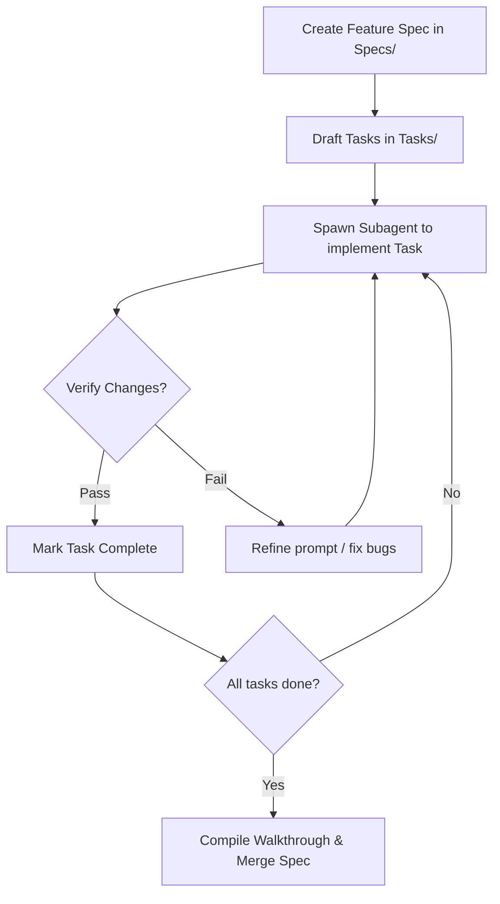

# Project Orchestration Dashboard

Welcome to the **Unity Inventory Management System (IMS)** developer workspace. This vault acts as the single source of truth for architecture context, feature specifications, and subagent orchestration.

---

## 📁 System Context & Standards

Reference these core documents before initiating new feature designs or code edits:
- 📖 [[System Context/project-overview|Project Overview]] — Tech stack, database schemas, and endpoints.
- 🏗️ [[System Context/architecture-context|Architecture Context]] — Multitenancy, permissions precedence, and transaction lifecycle.
- 📜 [[System Context/code-standards|Code Standards]] — Formatting, DI patterns, TAP conventions, React state.
- 🎨 [[System Context/ui-context|UI Context]] — Tailwind CSS v4 guidelines and design tokens.
- 🚦 [[System Context/ai-workflow-rules|AI Workflow Rules]] — Safety guidelines, terminal constraints, and validation protocols.
- 📈 [[System Context/progress-tracker|Progress Tracker]] — Active feature registry and engineering roadmap.

---

## 💡 Brainstorming & Architecture Decisions

Use these notes to collaborate, analyze market pain points, and document technical selections:
- 🧠 [[Brainstorming-Sessions/Market-Pain-Points-IMS|Market Pain Points]] — Analyze core problems to build high-value features.
- 📘 [[Knowledge/Domain-Knowledge|Domain Knowledge]] — Accumulate inventory, logistics, and database rules.
- ⚖️ [[Decisions/Feature-Decisions|Feature Decisions]] — Architecture Decision Records (ADRs) tracking structural choices.

---

## 🎯 Active Feature Specifications (`Specs/`)

| Specification Link | Status | Priority | Assignee / Notes |
| :--- | :--- | :--- | :--- |
| *No active specs yet. Create one using the Spec Template.* | | | |

---

## 🤖 Active Subagent Tasks (`Tasks/`)

| Task Link | Spec Link | Status | Assignee / Agent |
| :--- | :--- | :--- | :--- |
| *No active subagent tasks yet. Create one using the Task Template.* | | | |

---

## 🛠️ Spec-Driven Development Workflow Guide

Follow this sequence to design and implement features using subagents in Antigravity 2.0:

### 1. Specification (Design) Phase
1. Create a new markdown file inside `Specs/` using the [[Templates/Spec Template|Spec Template]].
2. Detail the requirements, scope, architectural impact, and step-by-step implementation tasks.
3. Review and get approval on the specification.

### 2. Task Allocation (Orchestration) Phase
1. For each implementation item in the spec, create a task markdown file in `Tasks/` using the [[Templates/Task Template|Task Template]].
2. Target the specific files the subagent needs to edit, and write highly detailed instructions inside the template's prompt section.
3. Link the task note inside the spec checklist and update the **Active Subagent Tasks** table above.

### 3. Execution (Subagent Run) Phase
1. Launch a subagent in Antigravity (using its native multi-agent workflow capabilities) pointing to the specific Task file.
2. Provide the subagent with the absolute path to the task file so it can read its rules, constraints, and instructions.
3. Monitor the subagent as it works on the targeted codebase files.

### 4. Verification & Closing Phase
1. Review the subagent's changes and execute compilation/lint/test commands to confirm stability.
2. Update the task status to `succeeded` (or `failed` if it requires rollback/retry).
3. Once all tasks are complete, update the specification status to `completed` and update the [[System Context/progress-tracker|Progress Tracker]].
